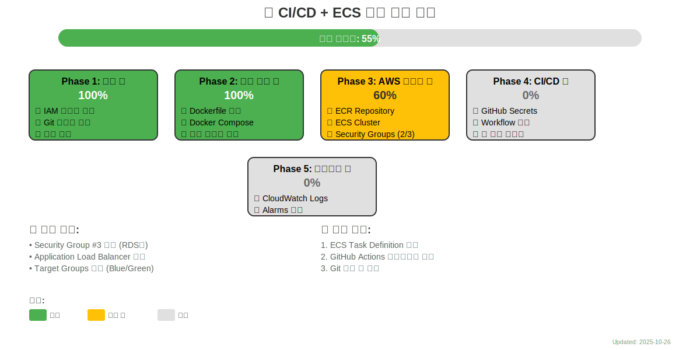
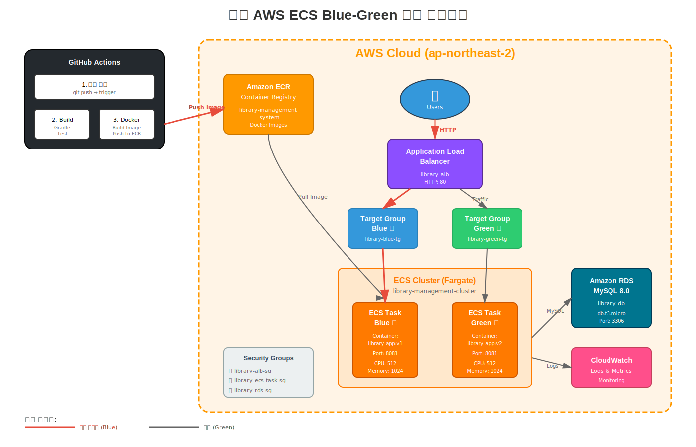
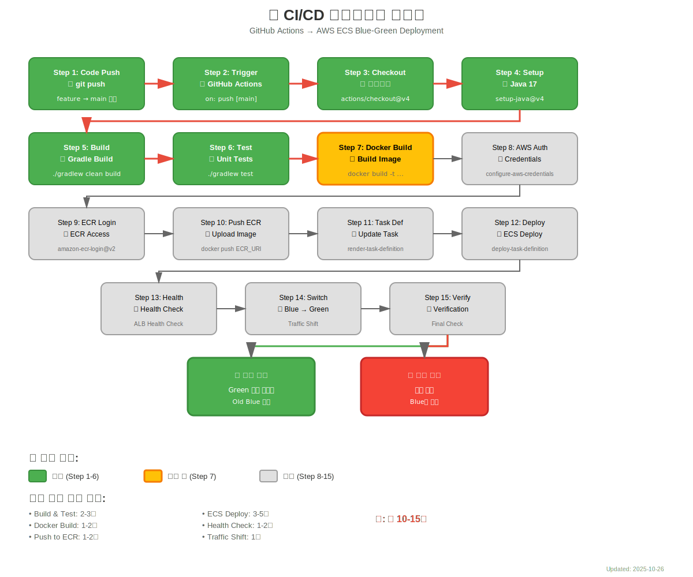

# 🎯 CI/CD + AWS ECS Blue-Green 배포 마스터 플랜 v1.4

> **중요**: 이 문서는 토큰 세션이 끊기더라도 작업을 이어갈 수 있도록 설계된 마스터 플랜입니다.
> 각 단계는 독립적으로 실행 가능하며, 체크리스트로 진행 상황을 추적할 수 있습니다.

---

## 📊 현재 진행 상황 시각화

### 전체 진행 상황


### 아키텍처 개요


### CI/CD 파이프라인 플로우


---

## 📋 목차
- [현재 진행 상황](#현재-진행-상황)
- [프로젝트 개요](#프로젝트-개요)
- [전체 작업 로드맵](#전체-작업-로드맵)
- [다음 작업 체크리스트](#다음-작업-체크리스트)
- [비용 최적화 전략](#비용-최적화-전략)
- [도메인 구매 가이드](#도메인-구매-가이드)
- [토큰 끊김 시 복구 시나리오](#토큰-끊김-시-복구-시나리오)

---

## 현재 진행 상황

### ✅ Phase 1: 준비 단계 (100% 완료)
- ✅ IAM 사용자 생성: `github-actions-deploy2`
- ✅ Git 브랜치 생성: `feature/cicd-ecs-blue-green-deployment`
- ✅ 관련 문서 6개 작성 완료

### ✅ Phase 2: 로컬 검증 단계 (100% 완료)
- ✅ Dockerfile 작성 (Multi-stage build, 보안 설정)
- ✅ docker-compose.yml 작성
- ✅ 로컬 빌드 및 테스트 성공 (483.26 MB)
- ✅ 웹 애플리케이션 정상 동작 확인

### 🔄 Phase 3: AWS 인프라 구축 (60% 완료)
- ✅ ECR Repository 생성: `library-management-system`
- ✅ ECS Cluster 생성: `library-management-cluster` (Fargate)
- ✅ GitHub Secrets 5/6 완료
- ✅ Security Groups 2/3 완료:
  - ✅ `library-alb-sg` (ALB용)
  - ✅ `library-ecs-task-sg` (ECS Task용)
  - 🔄 `library-rds-sg` (RDS용, 다음 작업)

### ⏳ Phase 4: GitHub Actions 연동 (0% 완료)
- 대기 중

### ⏳ Phase 5: 모니터링 설정 (0% 완료)
- 대기 중

---

## 다음 작업 체크리스트

### 🔴 즉시 진행 (우선순위 1)
- [ ] Security Group #3 생성 (`library-rds-sg`)
- [ ] Application Load Balancer 생성
- [ ] Target Groups 생성 (Blue/Green)
- [ ] ECS Task Definition 작성
- [ ] IAM Roles 생성 (ecsTaskExecutionRole, ecsTaskRole)

### 🟡 다음 진행 (우선순위 2)
- [ ] CloudWatch Logs 그룹 생성
- [ ] Parameter Store 설정
- [ ] ECS Service 생성
- [ ] GitHub Actions 워크플로우 작성
- [ ] Git 커밋 및 푸시

### 🟢 이후 진행 (우선순위 3)
- [ ] 첫 배포 테스트
- [ ] Blue/Green 전환 테스트
- [ ] 모니터링 설정
- [ ] 문서 최종 업데이트

---

## 📁 생성된 다이어그램 파일

```
docs/deployment/cicd/diagrams/
├── progress-timeline.svg         # ✅ 진행 상황 타임라인
├── architecture-overview.svg     # ✅ AWS 아키텍처 개요
└── cicd-pipeline-flow.svg        # ✅ CI/CD 파이프라인 플로우
```

---

## 프로젝트 개요

### 목표
Library Management System을 AWS ECS에 Blue-Green 배포 방식으로 배포하며, GitHub Actions를 통한 자동화된 CI/CD 파이프라인 구축

### 기술 스택
- **소스 코드**: Spring Boot 3.5.6, Java 17, Gradle
- **컨테이너**: Docker, Docker Compose
- **CI/CD**: GitHub Actions
- **클라우드**: AWS (ECS, ECR, ALB, CodeDeploy, RDS)
- **데이터베이스**: MySQL 8.0
- **배포 전략**: Blue-Green Deployment

### 작업 환경
- **OS**: Windows 11
- **IDE**: IntelliJ IDEA
- **AWS 리전**: ap-northeast-2 (서울)
- **프로젝트 경로**: `C:\Users\USER\Documents\choongang\Project\lecture\trainer\library-management-system (27)`

---

## 전체 작업 로드맵

자세한 내용은 위의 시각화 다이어그램을 참조하세요.

### Phase 1: 준비 단계 ✅ **완료**
모든 준비 작업 완료

### Phase 2: 로컬 검증 단계 ✅ **완료**
Docker 환경 구축 및 로컬 테스트 완료

### Phase 3: AWS 인프라 구축 🔄 **진행 중** (60%)
- ✅ ECR, ECS Cluster 생성
- ✅ Security Groups 2/3 완료
- 🔄 ALB, Target Groups, ECS Service 생성 예정

### Phase 4: GitHub Actions 연동 ⏳ **대기**
워크플로우 작성 및 첫 배포 테스트 예정

### Phase 5: 모니터링 및 최적화 ⏳ **대기**
CloudWatch 설정 및 알람 구성 예정

---

## 변경 이력

| 날짜 | 버전 | 변경 내용 | 작성자 |
|------|------|-----------|--------|
| 2025-10-26 | 1.4 | Security Groups 2/3 완료 반영, SVG 다이어그램 3개 추가, 시각화 섹션 추가 | Claude |
| 2025-10-26 | 1.3 | Git 브랜치 생성 완료 반영, 문서 파일 목록 업데이트 | Claude |
| 2025-10-26 | 1.2 | Phase 2 완료 - Docker 환경 구축 및 로컬 테스트 성공 | Claude |
| 2025-10-26 | 1.1 | Phase 1 완료, Phase 3 부분 완료 | Claude |
| 2025-10-24 | 1.0 | 마스터 플랜 초안 작성 | Claude |

---

**📌 현재 진행 상황 (2025-10-26 v1.4):**
- ✅ **Phase 1 완료** (100%): IAM 사용자 생성 및 Git 브랜치 설정
- ✅ **Phase 2 완료** (100%): 로컬 Docker 환경 구축
- 🔄 **Phase 3 진행 중** (60%): AWS 인프라 구축
  - ✅ ECR, ECS Cluster, Security Groups 2/3 완료
  - 🔄 현재: Security Group #3 생성 작업 중
- ⏳ **Phase 4 대기**: GitHub Actions 연동
- ⏳ **Phase 5 대기**: 모니터링 설정

**📊 전체 진행률: 약 55%**

**📌 다음 작업 (우선순위):**
1. Security Group #3 생성 (`library-rds-sg`)
2. Application Load Balancer + Target Groups 생성
3. ECS Task Definition 생성
4. IAM Roles 생성
5. CloudWatch Logs 그룹 생성
6. Parameter Store 설정
7. ECS Service 생성
8. GitHub Actions 워크플로우 작성
9. Git 커밋 및 푸시
10. 첫 배포 테스트

---

**문서 작성 완료** ✅
