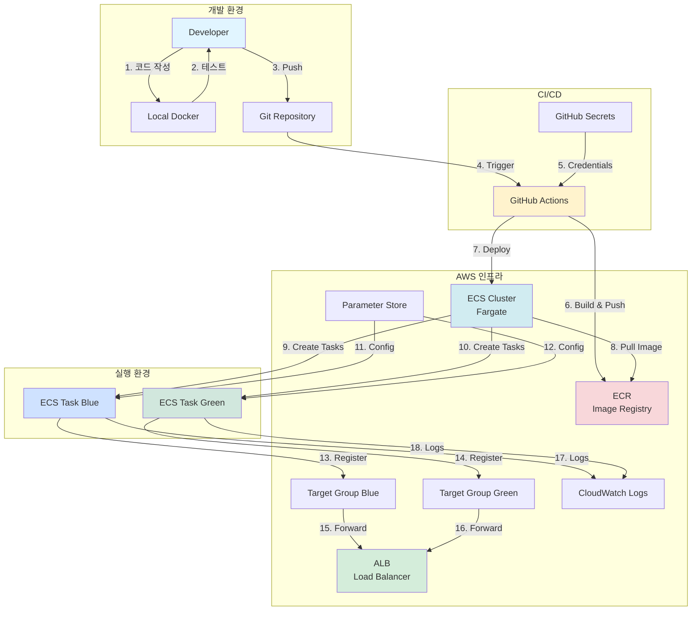
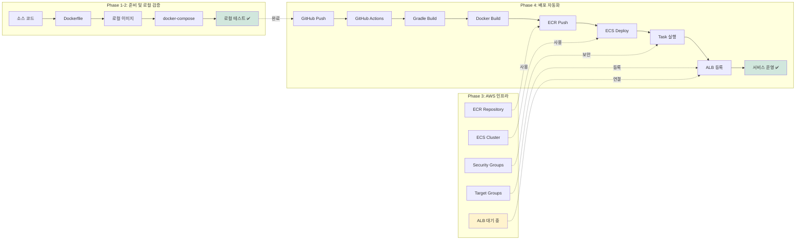
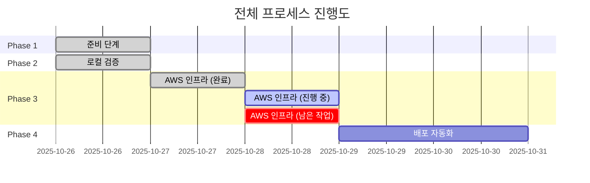
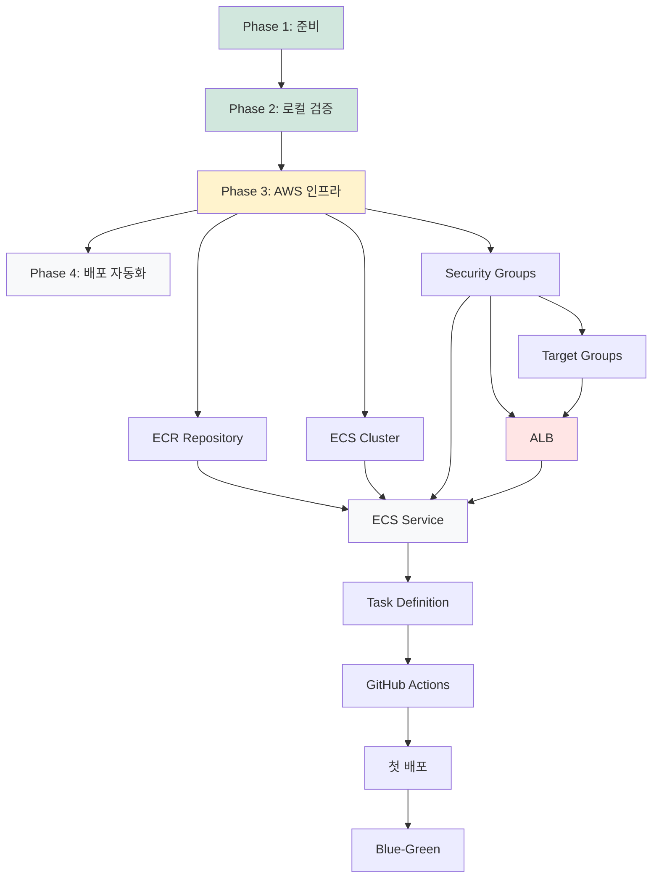

# 🔄 전체 배포 프로세스 시퀀스 다이어그램

> **마지막 업데이트**: 2025-10-28  
> **기준 문서**: 14-CURRENT-PROGRESS.md

---

## 전체 프로세스 흐름도

```mermaid
sequenceDiagram
    autonumber
    
    participant Dev as 👨‍💻 Developer
    participant Local as 💻 Local Environment
    participant AWS as ☁️ AWS Console
    participant GitHub as 🔧 GitHub
    participant ECR as 📦 ECR
    participant ECS as 🐳 ECS
    participant ALB as ⚖️ ALB
    participant User as 👤 End User

    Note over Dev,User: ✅ Phase 1: 준비 단계 (100% 완료)
    
    Dev->>AWS: 1. IAM 사용자 생성 (github-actions-deploy2)
    AWS-->>Dev: Access Key + Secret Key
    
    Dev->>GitHub: 2. Repository Secrets 설정
    Note right of GitHub: AWS_ACCESS_KEY_ID<br/>AWS_SECRET_ACCESS_KEY<br/>AWS_REGION<br/>ECR_REPOSITORY<br/>ECS_CLUSTER
    
    Dev->>Local: 3. Git 브랜치 생성
    Note right of Local: feature/cicd-ecs-blue-green-deployment
    
    Dev->>Local: 4. 문서 작성 (6개)
    Note right of Local: MASTER-PLAN.md<br/>AWS-RESOURCES-CHECKLIST.md<br/>IAM-SETUP-GUIDE.md 등

    Note over Dev,User: ✅ Phase 2: 로컬 검증 단계 (100% 완료)
    
    Dev->>Local: 5. Dockerfile 작성
    Note right of Local: Multi-stage build<br/>Non-root user<br/>Health check
    
    Dev->>Local: 6. docker-compose.yml 작성
    Note right of Local: MySQL 8.0<br/>App Container<br/>Networks & Volumes
    
    Dev->>Local: 7. application.yml 수정
    Note right of Local: prod 프로파일 추가<br/>환경 변수 설정
    
    Dev->>Local: 8. Docker 이미지 빌드
    Local-->>Dev: ✅ 빌드 성공 (483MB)
    
    Dev->>Local: 9. docker-compose up
    Local-->>Dev: ✅ MySQL + App 실행
    
    Dev->>Local: 10. 로컬 테스트
    Local-->>Dev: ✅ http://localhost:8081

    Note over Dev,User: 🔄 Phase 3: AWS 인프라 구축 (60% 완료)
    
    Dev->>AWS: 11. ECR Repository 생성
    AWS-->>Dev: ✅ library-management-system
    
    Dev->>AWS: 12. ECS Cluster 생성
    AWS-->>Dev: ✅ library-management-cluster (Fargate)
    
    Dev->>AWS: 13. Security Groups 생성 (3개)
    Note right of AWS: library-alb-sg<br/>library-ecs-task-sg<br/>library-rds-sg
    AWS-->>Dev: ✅ Security Groups 생성 완료
    
    Dev->>AWS: 14. Target Groups 생성 (2개)
    Note right of AWS: library-blue-tg (8081)<br/>library-green-tg (8081)
    AWS-->>Dev: ✅ Target Groups 생성 완료
    
    rect rgb(255, 240, 200)
        Note over Dev,AWS: ⏳ 현재 대기 중 (비용 고려)
        Dev->>AWS: 15. ALB 생성 (대기 중)
        Note right of AWS: Internet-facing<br/>HTTP:80<br/>→ blue-tg
    end
    
    rect rgb(240, 240, 240)
        Note over Dev,User: ⏳ Phase 3 남은 작업
        Dev->>AWS: 16. Parameter Store 설정
        Note right of AWS: /library/db/url<br/>/library/db/username<br/>/library/db/password
        
        Dev->>AWS: 17. CloudWatch Logs 그룹 생성
        Note right of AWS: /ecs/library-management-task
        
        Dev->>AWS: 18. ECS Service 생성
        Note right of AWS: library-service<br/>Desired: 1<br/>ALB 연결
        AWS-->>ECS: Task 생성 요청
    end

    Note over Dev,User: ⏳ Phase 4: 배포 자동화 (0% 완료)
    
    rect rgb(240, 240, 240)
        Dev->>Local: 19. ECS Task Definition 작성
        Note right of Local: aws/ecs-task-definition.json
        
        Dev->>Local: 20. GitHub Actions 워크플로우 작성
        Note right of Local: .github/workflows/deploy-to-ecs.yml
        
        Dev->>GitHub: 21. Git Commit & Push
        Note right of GitHub: Phase 2 완료 코드 푸시
        
        GitHub->>GitHub: 22. GitHub Actions 실행
        GitHub->>Local: Gradle 빌드
        Local-->>GitHub: JAR 파일 생성
        
        GitHub->>ECR: Docker 이미지 푸시
        Note right of ECR: library-management-system:latest
        ECR-->>GitHub: 푸시 완료
        
        GitHub->>ECS: Task Definition 업데이트
        ECS->>ECR: 이미지 Pull
        ECR-->>ECS: 이미지 다운로드
        
        ECS->>ECS: Task 실행
        Note right of ECS: Spring Boot App 시작<br/>Health Check 통과
        
        ECS->>ALB: Task IP 등록
        ALB-->>ECS: Target 등록 완료
        
        GitHub-->>Dev: ✅ 배포 성공 알림
        
        Dev->>ALB: 23. 배포 테스트
        ALB->>ECS: HTTP 요청 전달
        ECS-->>ALB: 응답 반환
        ALB-->>Dev: ✅ 정상 동작 확인
        
        Note over Dev,User: 🎯 Blue-Green 배포 시나리오
        
        Dev->>GitHub: 24. 코드 수정 후 Push
        GitHub->>GitHub: GitHub Actions 실행
        GitHub->>ECR: 새 이미지 푸시 (Green)
        GitHub->>ECS: 새 Task 생성 (Green)
        
        ECS->>ECS: Green Task 실행
        Note right of ECS: library-green-tg에 등록
        
        Dev->>ECS: Green Task Health Check
        ECS-->>Dev: ✅ Healthy
        
        Dev->>ALB: Target Group 전환
        Note right of ALB: Blue → Green
        ALB->>ECS: 트래픽을 Green으로 전환
        
        User->>ALB: HTTP 요청
        ALB->>ECS: Green Task로 전달
        ECS-->>ALB: 새 버전 응답
        ALB-->>User: 응답 반환
        
        Dev->>ECS: Blue Task 종료
        Note right of ECS: 무중단 배포 완료
    end
```



---

## 단계별 상세 설명

### Phase 1: 준비 단계 (100% 완료) ✅
```
Steps 1-4: AWS IAM 설정 및 Git 준비
- IAM 사용자 및 권한 설정
- GitHub Secrets 등록
- 문서 작성
```

### Phase 2: 로컬 검증 단계 (100% 완료) ✅
```
Steps 5-10: Docker 환경 구축 및 로컬 테스트
- Dockerfile, docker-compose.yml 작성
- 로컬 빌드 및 실행 확인
- 웹 애플리케이션 테스트
```

### Phase 3: AWS 인프라 구축 (60% 완료) 🔄
```
Steps 11-14: 완료된 작업 ✅
- ECR Repository
- ECS Cluster
- Security Groups (3개)
- Target Groups (2개)

Steps 15-18: 남은 작업 ⏳
- ALB 생성 (현재 대기 중)
- Parameter Store 설정
- CloudWatch Logs 그룹
- ECS Service 생성
```

### Phase 4: 배포 자동화 (0% 완료) ⏳
```
Steps 19-24: 예정 작업
- Task Definition 작성
- GitHub Actions 워크플로우 작성
- 자동 배포 파이프라인 구축
- Blue-Green 배포 테스트
```

---

## 주요 구성 요소 간 관계



---

## 데이터 흐름도



---

## 현재 진행 상태 표시



---

## 의존성 다이어그램



---

**생성일**: 2025-10-28  
**버전**: 1.0.0  
**기준 문서**: 14-CURRENT-PROGRESS.md
